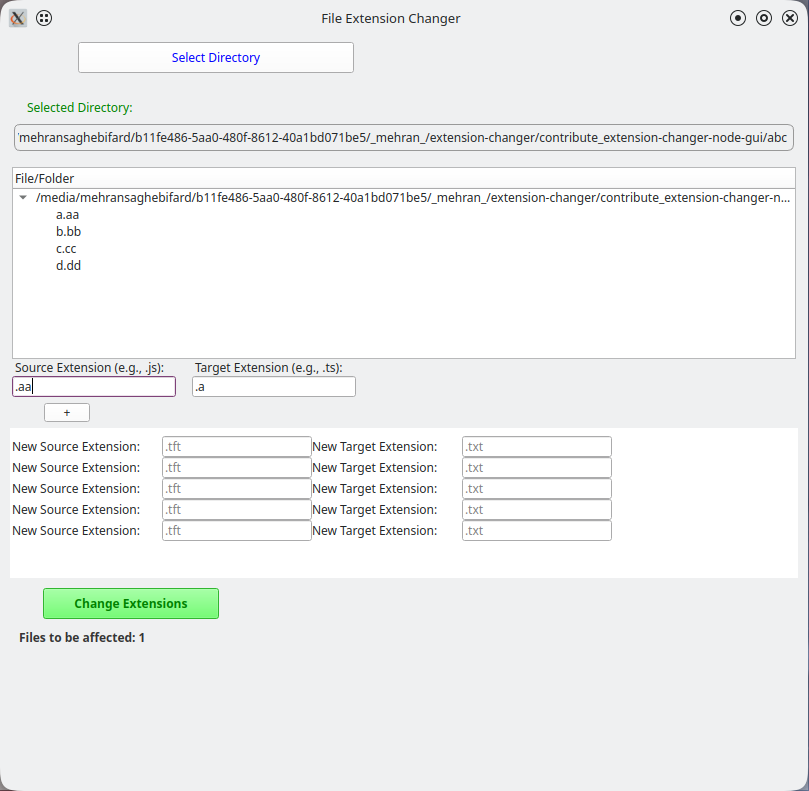

#### This App is used for changing a directory and it's sub-directory extensions using node js and Qt with nodeGUI

---

<p align="center">

  
</p>

usage :

> Step 1) install dependencies (please use **pnpn** and node version 16 )

> Step 2) use below script to run it

```javascript
npm run dev
// or
npm run dev -- --watch
```
